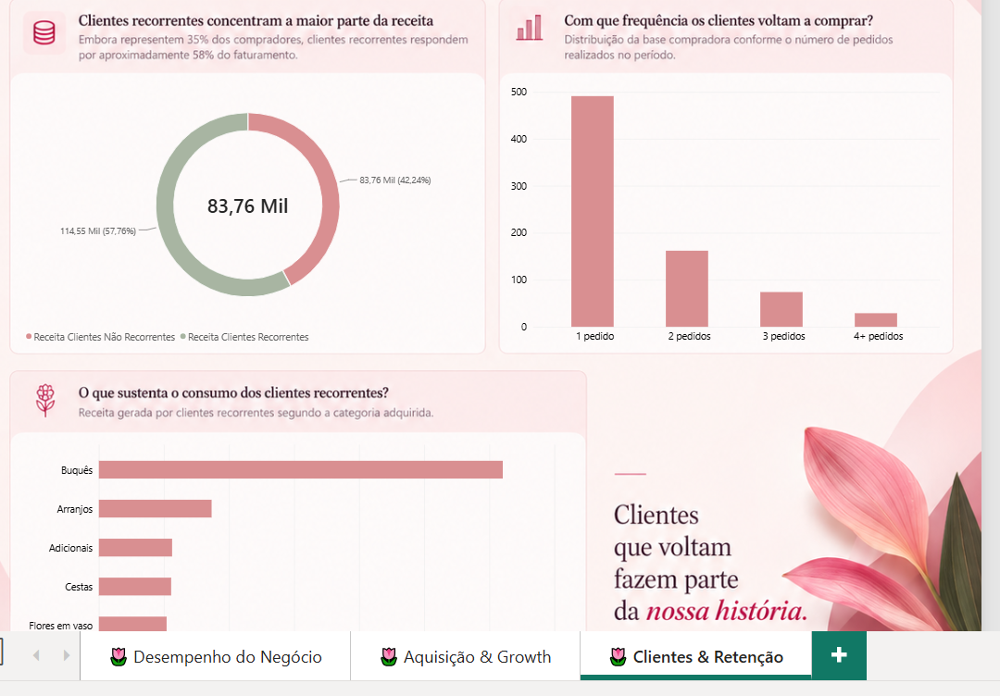
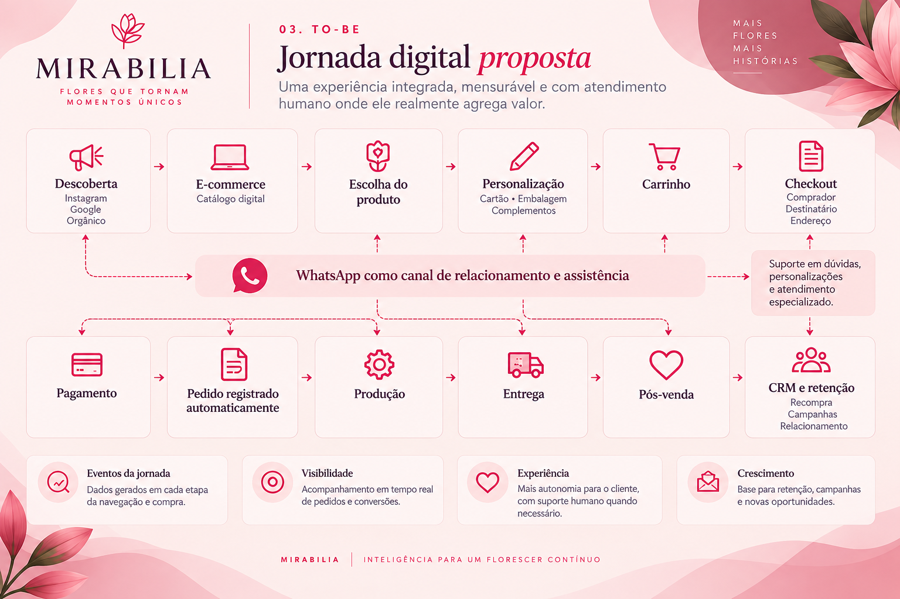
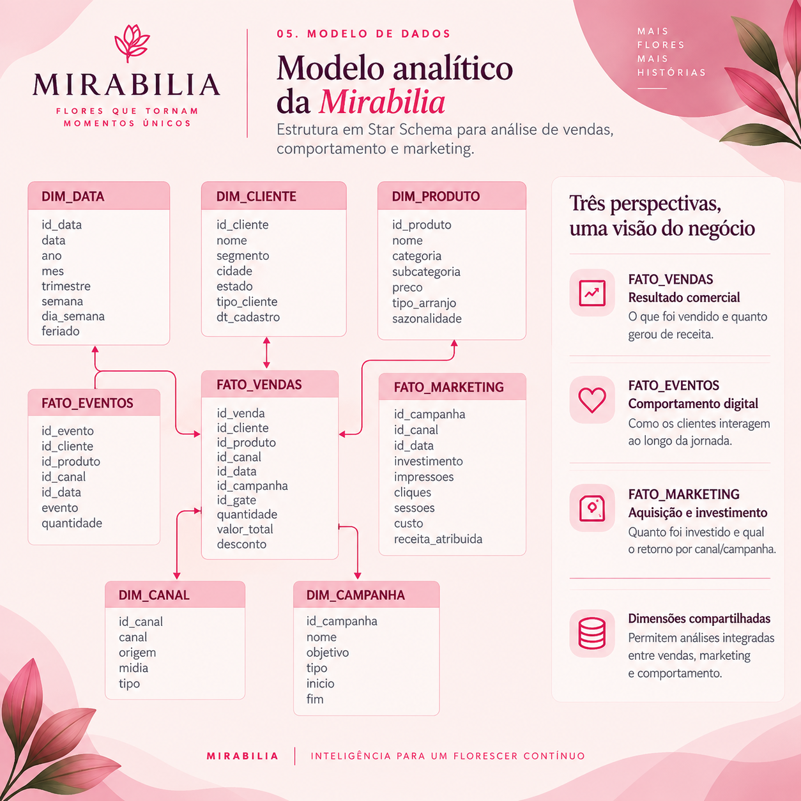

# 🌷 Mirabilia — Digital Analytics & Growth

> oii, aqui é um estudo de transformação digital, Business Intelligence e Growth aplicado a uma operação B2C fictícia, baseada no conteúdo da minha pós gradução, em Gestão de Tecnologia da Informação Corporativa.

## Sobre o projeto

A **Mirabilia** é uma floricultura fictícia criada por mim para explorar um problema comum em pequenos negócios: estar presente em canais digitais não significa, necessariamente, possuir uma operação digital integrada.

No cenário inicial, toda a jornada de compra acontece manualmente pelo WhatsApp — desde o primeiro contato até a confirmação da entrega — enquanto os pedidos são posteriormente registrados em planilhas.

O projeto parte da seguinte pergunta:

> **Como a Mirabilia pode evoluir de uma operação que utiliza canais digitais para um negócio digital integrado, mensurável e orientado por dados?**

A proposta foi redesenhar essa operação e demonstrar como processos, tecnologia e dados podem trabalhar juntos para melhorar a experiência do cliente e apoiar decisões de negócio.

---

## O desafio

No cenário AS-IS, a Mirabilia apresenta características como:

- atendimento e vendas conduzidos manualmente pelo WhatsApp;
- registro posterior dos pedidos em Excel;
- informações importantes da jornada armazenadas em conversas não estruturadas;
- baixa integração entre atendimento, pagamento, produção e entrega;
- dificuldade para acompanhar o funil de compra;
- pouca visibilidade sobre aquisição, conversão e retenção;
- dependência da atuação humana em praticamente todas as etapas da venda.

Um dos principais problemas identificados foi que a empresa conseguia registrar **a venda**, mas perdia grande parte do **contexto da venda**.

Informações como ocasião, orçamento, urgência e intenção do cliente permaneciam nas conversas e não se transformavam em dados estruturados para análise.

---

## Diagnóstico de maturidade digital

Foi utilizado um modelo didático de maturidade em seis dimensões:

| Dimensão | AS-IS |
|---|---:|
| Processos | 2/5 |
| Dados | 2/5 |
| Integração | 1/5 |
| Gestão | 2/5 |
| Experiência | 2/5 |
| Growth | 1/5 |

O diagnóstico indica uma operação **digitalizada, porém pouco integrada**, com grande dependência de processos manuais.

A partir disso, as iniciativas foram priorizadas por uma matriz de **Impacto × Esforço** e organizadas em três ondas:

**Estruturar → Integrar → Medir → Otimizar**

---

## Redesenho da jornada

No cenário TO-BE, tarefas rotineiras deixam de depender obrigatoriamente de atendimento humano.

A jornada proposta passa a contemplar:

**Descoberta → E-commerce → Produto → Personalização → Carrinho → Checkout → Pagamento → Produção → Entrega → Pós-venda → Retenção**

O WhatsApp continua presente, mas muda de função:

> **AS-IS:** WhatsApp como processo de venda  
> **TO-BE:** WhatsApp como canal de relacionamento e assistência

A tecnologia não substitui o atendimento humano onde ele gera valor; ela reduz a necessidade de intervenção humana em atividades repetitivas e estruturáveis.

---

## Arquitetura proposta

A arquitetura conceitual foi estruturada em:

**Canais → Integração → Aplicações → Dados → Analytics → Ativação**

com suporte transversal de infraestrutura, segurança e governança.

O princípio utilizado durante o projeto foi:

> **Nenhuma tecnologia entra na Mirabilia sem resolver um problema identificado anteriormente.**

---

## Modelagem de dados

Para a camada analítica, foi adotado um modelo dimensional em **Star Schema**.

### Dimensões

- `DIM_CLIENTE`
- `DIM_PRODUTO`
- `DIM_DATA`
- `DIM_CANAL`
- `DIM_CAMPANHA`

### Fatos

- `FATO_VENDAS`
- `FATO_EVENTOS`
- `FATO_MARKETING`

A separação permite analisar o negócio sob três perspectivas complementares:

**resultado comercial + comportamento digital + aquisição de clientes.**

---

# Dashboard

O relatório foi desenvolvido no **Power BI** e dividido em três perspectivas analíticas.

## 1. Desempenho do Negócio

A primeira página busca responder:

> **O que está acontecendo com o negócio e quais fatores explicam seu desempenho?**

São analisados receita, pedidos, ticket médio, margem, sazonalidade, categorias de produtos e origem das vendas.

---

## 2. Aquisição & Growth

A segunda página acompanha a jornada:

**Investimento → Tráfego → Conversão → Clientes → Receita → Eficiência**

Entre as análises realizadas estão:

- investimento × receita por canal;
- ROAS;
- custo por sessão;
- conversão por canal;
- comportamento no funil;
- eficiência das campanhas.

Um dos principais aprendizados do cenário simulado foi a diferença entre **escala e eficiência**.

Um canal pode gerar mais receita simplesmente porque recebe mais investimento, sem necessariamente apresentar o melhor retorno por real investido.

O funil também permitiu identificar a maior ruptura da jornada entre **visualização do produto e adição ao carrinho**.

---

## 3. Clientes & Retenção

A última página responde:

> **A Mirabilia consegue transformar compradores em clientes recorrentes?**

No cenário analisado:

- 756 clientes realizaram compras;
- 265 foram classificados como recorrentes;
- a taxa de recompra foi de 35,05%;
- clientes recorrentes responderam por aproximadamente 58% da receita.

A análise evidencia que aquisição é apenas uma parte do crescimento: o relacionamento após a primeira compra também possui impacto relevante no resultado.

---

## Principais aprendizados

O projeto reforçou que transformação digital não significa simplesmente substituir um canal manual por uma nova ferramenta.

Ela depende da integração entre:

**Pessoas + Processos + Tecnologia + Dados**

Outro aprendizado importante foi que:

> **Ter dados não torna uma organização data-driven. Ter capacidade de utilizá-los é apenas o começo.**

A infraestrutura analítica permite observar comportamentos, formular hipóteses e executar experimentos, formando um ciclo de melhoria contínua:

**Dados → Hipótese → Experimento → Resultado → Aprendizado → Nova iteração**

---

## Tecnologias e conceitos

- Power BI
- DAX
- Power Query
- Excel
- Modelagem Dimensional
- Star Schema
- Business Intelligence
- Digital Analytics
- Growth Analytics
- Funil de Conversão
- Customer Journey
- Retenção
- ROAS e CAC
- Transformação Digital

---

## Dados

Todos os dados utilizados neste projeto são **fictícios e gerados exclusivamente para fins educacionais e de portfólio**.

A Mirabilia também é uma empresa fictícia, com nome super adorável ne kkkkk

Nenhuma informação representa clientes, consumidores ou operações comerciais reais.

---

## Autoria

Projeto desenvolvido por **Ana Clara Araujo Vaz** como estudo aplicado de transformação digital, dados e Business Intelligence.

🌷 *Mirabilia — inteligência para um florescer contínuo.*
